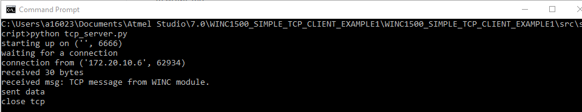
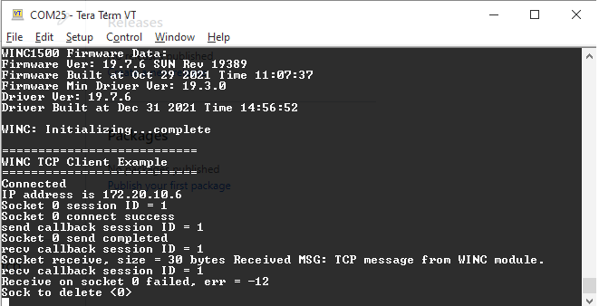

# SAM9x60-EK-WINC15x0-TCP-Client-Demo

The WINC example application running on SAM9x60-EK evaluation kit demonstrates as a conventional, open tcp client-server communication.

## Description

In this demonstration, the WINC Driver will connect to a BSS and begin a TCP client socket connection to a remote server service.  
This demonstration can be configured the following settings in the source code.  
• The BSS to connect to.  
• The TCP server address and port to connect to.  
• The receive buffer size.  
• The message which should be sent as the first data once connected to the server..

## Downloading and building the application

click Clone button to clone this repository or download as zip file in this page.

To build the application, refer to the following table and open the project using its IDE.

| Project Name      | Description                                    |
| ----------------- | ---------------------------------------------- |
| sam_9x60_ek_winc1500.X | MPLABX project for [SAM9X60-EK Evaluation Kit](https://www.microchip.com/developmenttools/ProductDetails/DT100126) |
| sam_9x60_ek_winc1500_freertos.X | MPLABX project for [SAM9X60-EK Evaluation Kit](https://www.microchip.com/developmenttools/ProductDetails/DT100126) |
|||

## Setting up AT91Bootstrap loader

To load the application binary onto the target device, we need to use at91bootstrap loader. Refer to the [at91bootstrap loader documentation](https://github.com/Microchip-MPLAB-Harmony/core_apps_sam_9x60/blob/master/apps/docs/readme_bootstrap.md) for details on how to configure, build and run bootstrap loader project and use it to bootstrap the application binaries.

## Setting up the hardware

The following table shows the target hardware for the application projects.

| Project Name| Board|
|:---------|:---------:|
| sam_9x60_ek_winc1500.X   sam_9x60_ek_winc1500_freertos.X    | [SAM9X60-EK Evaluation Kit](https://www.microchip.com/developmenttools/ProductDetails/DT100126) |
|||

### Setting up [SAM9X60-EK Evaluation Kit](https://www.microchip.com/developmenttools/ProductDetails/DT100126)

#### Addtional hardware required

- SD Card with FAT32 file system

#### Setting up the SD Card

- Download harmony MPU bootstrap loader from this [location](firmware/at91bootstrap_sam_9x60_ek.X/binaries/boot.bin)
- Copy the downloaded boot loader binary( boot.bin) onto the SD card

#### Setting up the board

- SDMMC slot used for bootloading the application is SDMMC0 (J4)
- Connect the USB port J22 on board to the computer using a micro USB cable (to enable debug com port)
- Connect the USB port J7 on board to the computer using a micro USB cable (to power the board)
- *NOTE - Reset push button is labelled as SW3*
- Connect WINC1510 WiFi 7 Click board to the mikro BUS connector of the board 

## Running the Application

1. On your PC, execute the tcp_server.py python script to set up a TCP server, the TCP server port is 6666 by default
2. In file example_conf.h, modify the AP SSID and password, and the TCP sever IP address, which is the IP address of your PC.  
       
3. Build the application using its IDE
4. Copy the output binary (named 'harmony.bin') onto the SD Card (Refer to the 'Setting up hardware' section above for setting up the SD card)
5. Insert the SD card into SDMMC slot on the board (Refer to the 'Setting up hardware' section for the correct SDMMC slot)
6. Open the Terminal application (Ex.:Tera term) on the computer.
7. Connect to the EDBG/Jlink Virtual COM port and configure the serial settings as follows:
    - Baud : 115200
    - Data : 8 Bits
    - Parity : None
    - Stop : 1 Bit
    - Flow Control : None

8. Reset the board to run the application
9. The board run as a TCP client to connect to the TCP server running on your PC, and set the message "TCP message from WINC module." to the TCP server. TCP server echo back the message to the board.
    
      
    
      
